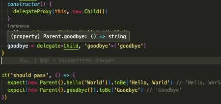

## ts-delegate

A library make delegate method with type inherited.

## Usage

```ts
import { delegate, delegateProxy } from "./";

interface IChild {
  hello: (name: string) => string;
  goodbye: () => string;
}

class Child implements IChild {
  hello(name: string) {
    return `Hello, ${name}`;
  }
  goodbye() {
    return "Goodbye";
  }
}

class Parent {
  constructor() {
    delegateProxy(this, new Child());
  }
  hello = delegate<Child, "hello">("hello");
  goodbye = delegate<Child, "goodbye">("goodbye");
}

console.log(new Parent().hello("World")); // 'Hello, World'
console.log(new Parent().goodbye()); // 'Goodbye'
```

The hello and goodbye methods types are inherited from Child class.



## API

### delegateProxy(obj, to, {delegatorId?: string})

The `obj` is an object delegates method to object's set to `to`.
Proxy to delegate is set internal variable default named `__delegator_${call_delegate_count}` of obj.
If you want multiple instance to delegate, use unique delegatorId by each internal instance.

```ts
class Parent {
  constructor() {
    delegateProxy(this, new Child1(), { delegatorId: "__child1" });
    delegateProxy(this, new Child2(), { delegatorId: "__child2" });
  }
  hello = delegate<Child, "hello">("hello", { delegatorId: "__child1" });
  goodbye = delegate<Child, "goodbye">("goodbye", {
    delegatorId: "__child2",
  });
}
```

You can also use symbol as delegatorId by each class for example,

```ts
class Parent {
  static DELEGATOR_ID = {
    child1: symbol(),
    child2: symbol(),
  };
  constructor() {
    delegateProxy(this, new Child1(), {
      delegatorId: Parent.DELEGATOR_ID.child1,
    });
    delegateProxy(this, new Child2(), {
      delegatorId: Parent.DELEGATOR_ID.child2,
    });
  }
  hello = delegate<Child, "hello">("hello", {
    delegatorId: Parent.DELEGATOR_ID.child1,
  });
  goodbye = delegate<Child, "goodbye">("goodbye", {
    delegatorId: Parent.DELEGATOR_ID.child2,
  });
}
```

### delegate<InstanceClass, MethodName extends string>(methodName: MethodName, {delegatorId: '\_\_child1'})

It maps proxy method to parent class's instance. delegatorId can be specified to which instance methods be mapped to their parent as already described.
It can map plain object using binding instance. You should two type parameters for method's type inheritance.

```ts
const obj = {} as Pick<IChild, "hello">;
delegateProxy(obj, new Child());
obj.hello = delegate<Child, "hello">("hello").bind(obj);
// or
obj.hello = delegateProxy(obj, new Child()).hello;

console.log(obj.hello("World")); // 'Hello, World'
```
